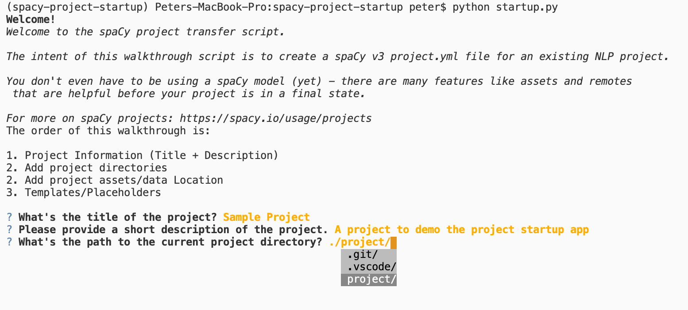

# spaCy v3 Project Startup / Transfer / Migration

This tool will walk you through creating a simple `project.yml` file for use with [spaCy projects](https://spacy.io/usage/projects). Optionally it will create the relevant project attributes given an existing folder structure.

Note that there are already many excellent templates for starting a project at https://github.com/explosion/projects.  These will probably be what you need most of the time. If one of those fits your need, use them! They contain helpful comments on how the different aspects of the project file works.

My use case was such that none of the templates were a good fit. I had an old NLP project with existing files I was transitioning into spaCy but didn't yet use a spaCy model. I wanted to use the project framework to organize the collection of scripts and data I was already using and delete a gnarly Makefile. I also wanted to play around with [questionary](https://github.com/tmbo/questionary) 🤓

**Standard code quality disclaimer**: I wrote this in a few hours, so there are no tests. It's also not a reflection of everything you could do with a project -- for example pulling assets from a git repository instead of a url.

### Requirements
If you've already got spaCy in your virtual environment of choice, you should just need to install `questionary` via pip, becauase the only other dependency `srsly` is included with spaCy. 

For reference, the versions of both packages used to develop this are included in the `requirements.txt`.

## Usage

```bash
git clone https://github.com/pmbaumgartner/spacy-v3-project-startup
pip install -r requirements.txt
python startup.py
```

Answer the questions and you'll have a nice `project.yml` in whatever folder you told the script was your project folder.

### Sample Workflow

```
Welcome!
Welcome to the spaCy project transfer script.

The intent of this walkthrough script is to create a spaCy v3 project.yml file for an existing NLP project.

You don't even have to be using a spaCy model (yet) - there are many features like assets and remotes
 that are helpful before your project is in a final state.
 
For more on spaCy projects: https://spacy.io/usage/projects
The order of this walkthrough is:

1. Project Information (Title + Description)
2. Add project directories
2. Add project assets/data Location
3. Templates/Placeholders

? What's the title of the project? Sample Project
? Please provide a short description of the project. A project to demo the project startup app
? What's the path to the current project directory? ./project/
Great, we'll be using: ./project
? Would you like to add current subdirectories of ./project as project directories? (To ensure they exist for future commands and workflows) Yes
2 directories added.
? Is there an existing folder of data or assets the project uses you'd like to add? Yes
? Where is this directory located? ./project/data/
1 asset files found.
? Would you like to add the md5 checksums to current asset files? (this can prevent future unnecessary redownloading) Yes
? Would you like to add an example variable? (For consistent argument or path use across multiple commands) Yes
? Would you like to add an example remote storage? (For pushing/pulling workflow output) Yes
? Would you like to add example commands? Yes
? Would you like to add a workflow example? Yes
Project yml output to project/project.yml.
```



**Example project.yml output from above**

```yaml
title: Sample Project
description: A project to demo the project startup app
directories:
  - models
  - data
assets:
  - dest: data/datafile
    description: ''
    checksum: d41d8cd98f00b204e9800998ecf8427e
vars:
  example: example1
  other_example: another-example
remotes:
  default: s3://my-spacy-bucket
  local: /mnt/scratch/cache
commands:
  - name: make_temporary_file
    help: make a temporary file  (EXAMPLE)
    script:
      - touch temporaryfile
    outputs:
      - temporaryfile
  - name: delete_temporary_file
    help: Print listed files (EXAMPLE)
    script:
      - rm -f temporaryfile
    deps:
      - temporaryfile
workflows:
  all:
    - make_temporary_file
    - delete_temporary_file


# This project.yml generated with https://github.com/pmbaumgartner/spacy-v3-project-startup
# For more on spaCy projects, see: https://spacy.io/usage/projects and https://spacy.io/api/cli#project
# And see the templates at: https://github.com/explosion/projects
```

